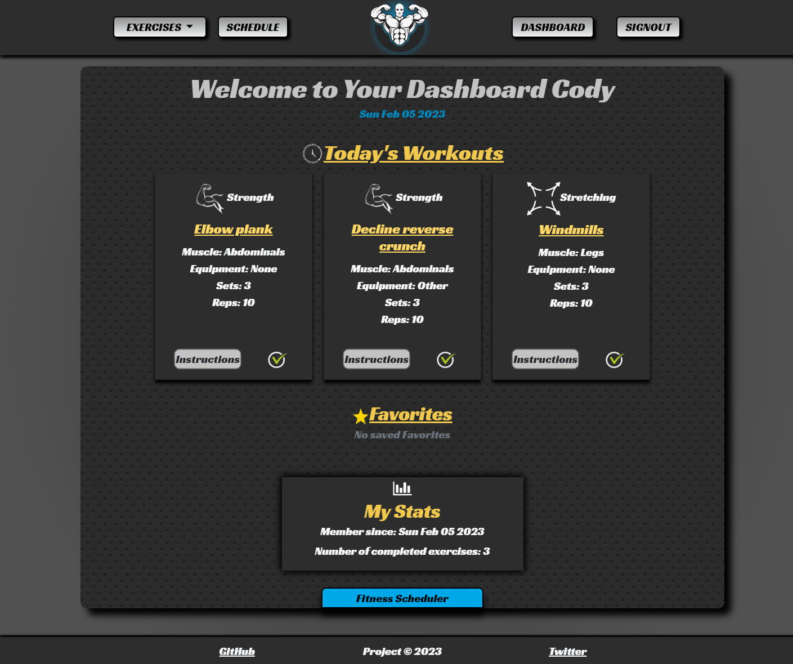

# Workout-Planner 

## *Table of Contents*
 ___
  - [Installation](#description)
  - [Features](#features)
  - [Usage](#usage)
  - [Software](#software)
  - [Resources](#resources)
  - [Credits](#credits)
  - [License](#license)
  - [Questions](#questions)
  - [Screenshots](#screenshots)

## *Description*
___
GetFit is a website devoted to assisting users to become physically active and providing the necessary tools to aid users on their fitness journeys. GetFit is a collaborative project that is based off MVC (Model-View-Controller) paradigm and utilizes a wide array of softwares to store and manipulate user exercise data.

##  *Features*
___
### In order to access the main features of GetFit you must be logged in.
- Current Features
    - Personalized workout scheduling
    - Exercise catalog
    - Fitness Tracker
- Upcoming Features
    - Calorie Tracker
    - Animated exercise guides
    - Daily/weekly challenges
    - Supplements Store
    - GPS jogging tracker
    - Leaderboards

## *Usage*
___
### In order to have full access to GetFit the user must be a member
- Becoming a Member
  - Click account button on upper right corner of webpage.
  - If already a member, sign in with credentials
  - If not a member, click on the link provided on the bottom of the login card
  - Provide the registration card a username (must not exist), valid email, and password (must be at least 8 characters long.)
- Creating your schedule
  - In order to start creating your work schedule make sure to be logged in.
  - Click on the exercises button and choose a category.
  - Once presented with the exercise catelog, click on the fitness scheduler button located underneath the navigation bar.
  - Select an exercise, a date, and fill in the details in applicable.
  - Once finished, click the submit button. Congratulations, you have scheduled your first GetFit workout!
- Navigating your dashboard
  - Click the dashboard link in the navigation bar
  - Here you can see today's scheduled exercises, favorites, account statistics, and have access to the fitness scheduler
- Schedule Page
  - Click the schedule link the in the navigation bar
  - Choose a date and click view schedule
  - If no exercises are scheduled on the date, the page will be empty.

## *Software*
___
Projeect_name was built/deployed using the following:
- VSCode
- Gitbash/Github
- Heroku
- MySQL
- Node JS
  - NPM
  - Sequelize(Object Relational Mapping)
  - Handlebars
  - Express
    - express-session
    - express-handlebars
    - express-session-sequelize
    - connect-session-sequelize
  - mysql2
  - bcrypt
  - dotenv
- HTML
- CSS
  - Bootstrap
  - Granim API
- Javascript
  - JQuery
- MVC paradigm (Model-View-Controller)
- OOP (Object Oriented Programming)

## *Resources*
___
- Granim | https://sarcadass.github.io/granim.js/
- Google Images | https://images.google.com/
- Figma (collaborative web application) - https://figma.com/
- Workout API | https://api.api-ninjas.com

## *Credits*
___
- Database/Server Development
  - Nick: https://github.com/NBADRAUN
  - Jelena: https://github.com/Jelenarog
- UI/Styling/Design 
  - Lauren: https://github.com/lgenzone
  - Cody: https://github.com/Ccooper9893

## *License*
___
This application is covered under the MIT license.
For more information about this license please visit https://opensource.org/licenses/MIT

## *Questions*
___
For comments/conerns please contact us at https://github.com/Jelenarog/Workout-planner

## *Screenshots*
___
Homepage

Dashboard

Schedule

Exercises

